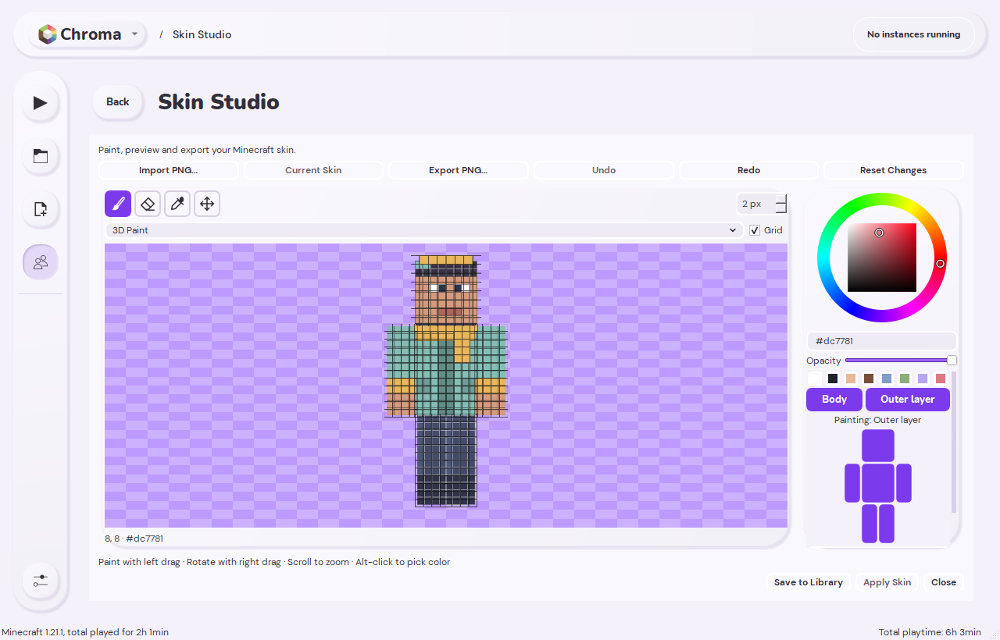
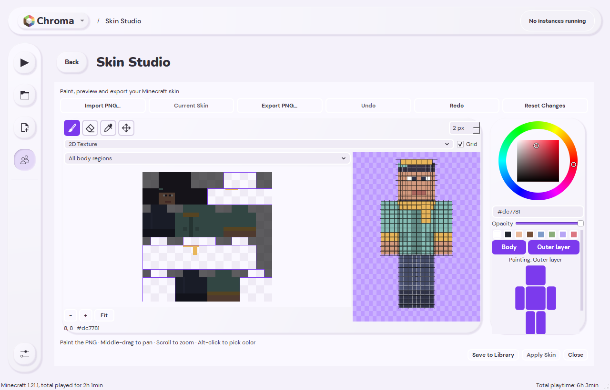
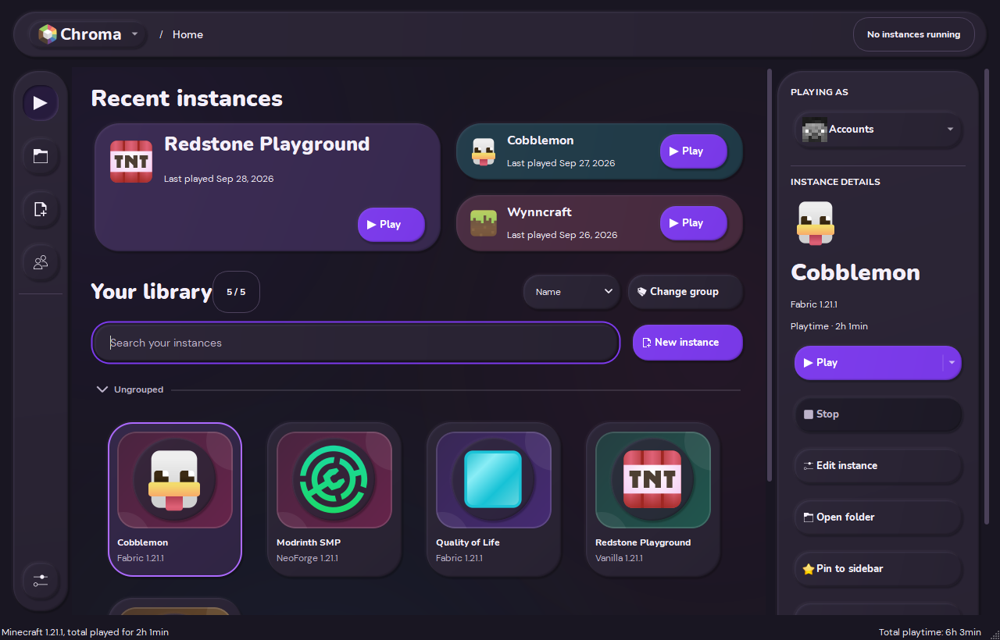
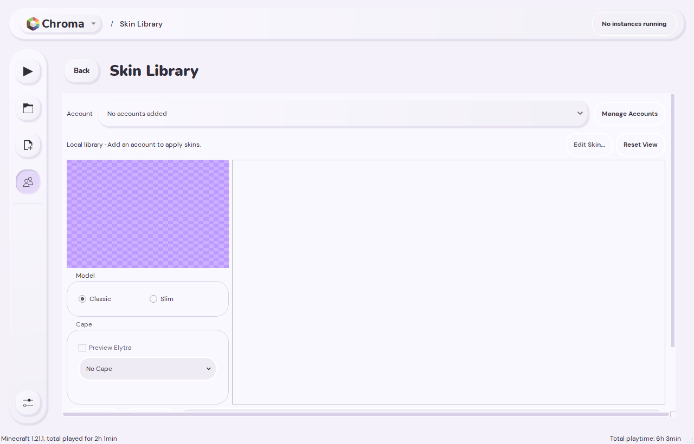
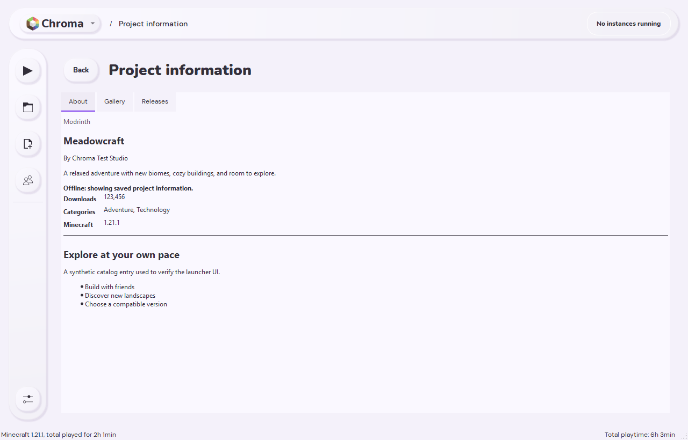

<h1 align="center">Chroma</h1>

<strong>Minecraft instances, modpacks, and skins in one native launcher.</strong> 
Built on Prism Launcher with C++, Qt Widgets, and customizable light and dark clay themes.

  <a href="https://github.com/nikitasokolov01/chroma/releases/tag/v0.3.0">Download for Windows</a> ·
  <a href="docs/CHROMA.md">Guide</a> ·
  <a href="docs/CHROMA-MIGRATION.md">Use your Prism library</a> ·
  <a href="https://github.com/nikitasokolov01/chroma/issues">Report an issue</a>

Chroma rebuilds Prism Launcher's default interface around a card library, a persistent sidebar, and screens that open inside the main window. It keeps Prism's instance management and installation workflows underneath, with a visual direction inspired by Modrinth.

**Independent project:** Chroma is based on Prism Launcher 10.0.5. It is not affiliated with or endorsed by Prism Launcher, Modrinth, Mojang, or Microsoft.

## Download

**v0.3.0 preview · Windows x64**

| Package | Use it when… |
| --- | --- |
| [Windows installer](https://github.com/nikitasokolov01/chroma/releases/download/v0.3.0/Chroma-0.3.0-Windows-x64-Setup.exe) | You want a normal installation for your Windows account. |
| [Portable ZIP](https://github.com/nikitasokolov01/chroma/releases/download/v0.3.0/Chroma-0.3.0-Windows-x64.zip) | You want to extract a folder and run `chroma.exe` from it. Keep its files together. |

Read the [v0.3.0 release notes](docs/releases/0.3.0.md) for requirements and verification results. **Upgrading from 0.2.0 requires this manual download once.** From 0.3.0, Chroma checks its GitHub releases automatically, including preview releases. You choose **Download update**, then **Install and restart** after checksum verification. Automatic checks can be disabled in **Settings → Launcher → Updater**. See [updating Chroma](docs/CHROMA.md#updating-chroma).

## New in v0.3.0: clearer Skin Studio controls

Paint directly on a Classic or Slim 3D model, or switch to the 2D texture beside
a live preview. Both views share the same skin, brush, color, and undo history.

| Paint in 3D | Edit the 2D texture |
| --- | --- |
|  |  |

- **Pick colors in place.** The color wheel, hex value, and opacity stay visible beside the canvas.
- **See each pixel.** The 3D grid follows both body and outer surfaces, including transparent outer pixels. The Grid control works in both editing views.
- **Choose what is visible.** Use **Body** and **Outer layer** to show each layer; click the head, torso, arms, or legs in the body diagram to hide parts and reach surfaces behind them. Space toggles a focused part.
- **Paint the visible outer layer.** When **Outer layer** is on, painting changes only that layer. Hide it to paint the body. The same rule applies in 2D.
- **Keep editing flexible.** Use brush, eraser, color picker, undo/redo, PNG import/export, and local library saving. Base pixels stay opaque; outer layers support transparency.

Open **Skins** in the sidebar, choose a skin, then select **Edit Skin…**. In 3D,
left-drag paints, right-drag rotates, and scrolling zooms. Switch **3D Paint →
2D Texture** to work on individual pixels. With a canvas focused, use **B** for
brush, **E** for eraser, **I** for color picker, and **H** to rotate or pan.

Editing and exporting work without an account. **Apply Skin** requires a Microsoft
account with a Minecraft Java profile. Devices without OpenGL use the 2D editor
and image preview.

## More features

- **Organize instances.** Search grouped cards, open recent instances, or drag cards into a saved manual order. Name and last-played sorting remain available.
- **Pin from the library.** Drop an instance onto the sidebar to pin it, then open its settings with one click.
- **Manage skins from the sidebar.** Open **Skins**, switch accounts with the dropdown, and manage skins and capes without changing your default launch account. Local editing works before adding an account.
- **Browse modpacks and project details.** Browse Modrinth, CurseForge, ATLauncher, Technic, and FTB Legacy. Modrinth and CurseForge share **About**, **Gallery**, and **Releases** views with cached project information for offline use. Available services depend on the build's API configuration.
- **Work inside one window.** Instance editing, settings, accounts, and installation flows open inline. Smooth scrolling and restored scroll positions help with navigation; clickable cards and controls use hand cursors.
- **Handle larger libraries.** Card painting visits visible rows, geometry is cached, and progress updates avoid full layouts. The library background stays still while idle. Regression coverage includes a 4,000-instance library.
- **Choose your appearance.** Use light or dark clay themes and preset or custom accents. Windows caption colors follow the theme while retaining native window controls.
- **Use your existing Prism profile.** Open instances, worlds, accounts, and custom instance locations directly, without copying modpacks.

Launcher commands now live in the **Chroma header menu**. Click **Chroma** at the
top of the window for update checks, profile selection, accounts, and instance
actions. The sidebar keeps navigation and pins together.

### Light and dark themes

| Light | Dark |
| --- | --- |
|  |  |

### Skin Library

Choose whose skins and capes to manage with the account dropdown. Your default
launch account stays unchanged, and local skins remain available without signing in.

### Browse, choose, install

| Choose a service | Explore a pack |
| --- | --- |
|  |  |

### Familiar controls, inside the new interface

| Launcher settings | Compact layout |
| --- | --- |
|  |  |

These screenshots were captured from the running native Windows application for
this revision. Instances, accounts, skins, and catalog entries use synthetic test
data; they do not show a signed-in user's profile.

## Already use Prism?

1. Close Prism and any games using its profile.
2. In Chroma, choose **Chroma header menu → Use Prism folder…**.
3. Select the data folder containing `prismlauncher.cfg`, inspect it, and choose **Use this folder**.

Chroma restarts once and remembers that folder. Instances, worlds, accounts, and launch settings are shared directly; changes affect the same files. Keep one launcher open at a time. Chroma's appearance preferences are stored separately in `chroma-ui.cfg`.

See the [existing-profile guide](docs/CHROMA-MIGRATION.md) for portable profiles, custom folders, and `--dir` overrides.

## Documentation and development

- [Getting started, accounts, building, and testing](docs/CHROMA.md)
- [Appearance and accent colors](docs/appearance.md)
- [Using an existing Prism folder](docs/CHROMA-MIGRATION.md)
- [UI features, implementation notes, and verification results](docs/UI-MODERNIZATION.md)
- [Privacy and local account data](PRIVACY.md)

The interface is implemented in C++ and Qt Widgets and compiled into the launcher. Development builds use the scripts in [`scripts/`](scripts/); prerequisites and native UI tests are covered in the [build guide](docs/CHROMA.md#build-from-source).

Found a problem? [Open an issue](https://github.com/nikitasokolov01/chroma/issues) with the Chroma version, steps to reproduce, and a screenshot when helpful. Review logs before sharing them and remove account information or access tokens.

## Credits and license

Chroma builds on the work of the [Prism Launcher](https://github.com/PrismLauncher/PrismLauncher), PolyMC, and MultiMC contributors. Prism's original project information is preserved in the [upstream README](docs/UPSTREAM_README.md).

Launcher code is licensed under **GPL-3.0-only**; see [LICENSE](LICENSE). Third-party components retain their own licenses and notices in [THIRD_PARTY_NOTICES.md](THIRD_PARTY_NOTICES.md), [COPYING.md](COPYING.md), and their source directories. Upstream logos and branding retain their [CC BY-SA 4.0 license](program_info/LICENSE). See the [release licensing notes](docs/RELEASE-LICENSING.md) for distribution and corresponding source information.
