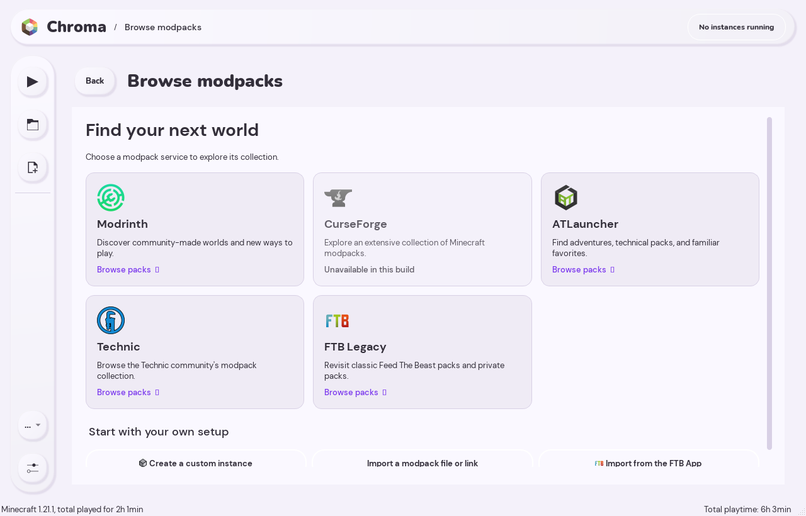
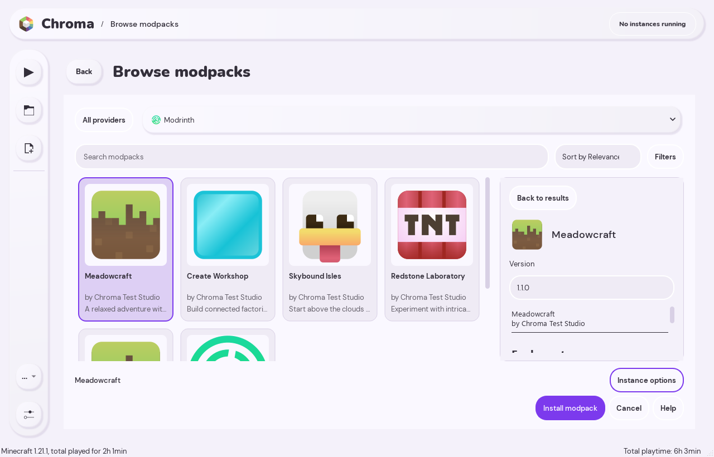
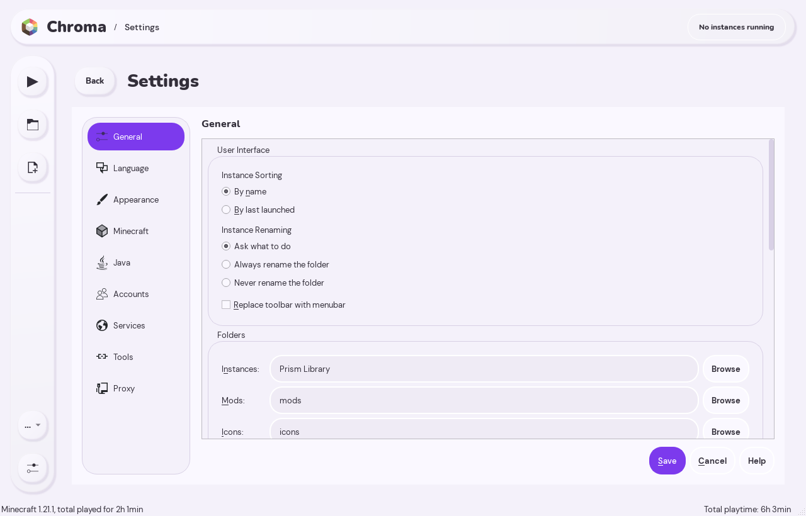
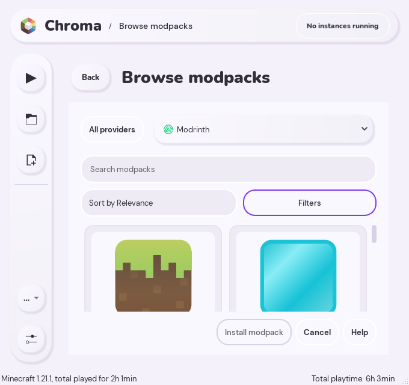

<h1 align="center">Chroma</h1>

<strong>A fresh interface for your Minecraft library.</strong> 
Native C++ and Qt. Built on Prism Launcher. Soft clay surfaces, vivid violet, and room for your own colors.

  <a href="https://github.com/nikitasokolov01/chroma/releases/tag/v0.1.0">Download for Windows</a> ·
  <a href="docs/CHROMA.md">Guide</a> ·
  <a href="docs/CHROMA-MIGRATION.md">Use your Prism library</a> ·
  <a href="https://github.com/nikitasokolov01/chroma/issues">Report an issue</a>

Chroma rebuilds Prism Launcher's default interface around a card library, a persistent sidebar, and screens that open inside the main window. It keeps Prism's instance management and installation workflows underneath, with a visual direction inspired by Modrinth.

**Independent project:** Chroma is based on Prism Launcher 10.0.5. It is not affiliated with or endorsed by Prism Launcher, Modrinth, Mojang, or Microsoft.

## Download

**v0.1.0 preview · Windows x64**

| Package | Use it when… |
| --- | --- |
| [Windows installer](https://github.com/nikitasokolov01/chroma/releases/download/v0.1.0/Chroma-0.1.0-Windows-x64-Setup.exe) | You want a normal installation for your Windows account. |
| [Portable ZIP](https://github.com/nikitasokolov01/chroma/releases/download/v0.1.0/Chroma-0.1.0-Windows-x64.zip) | You want to extract a folder and run `chroma.exe` from it. Keep its files together. |

Read the [release notes](https://github.com/nikitasokolov01/chroma/releases/tag/v0.1.0) for this preview's requirements and known limitations. Updates are downloaded from Releases; the upstream binary updater is disabled.

## Your library, in one place

- **Jump back in.** Recently played instances sit above a searchable, grouped card library.
- **Pin your favorites.** Keep instance shortcuts in the sidebar and open their settings with one click.
- **Browse by service.** Choose Modrinth, CurseForge, ATLauncher, Technic, or FTB Legacy, then browse covers, filters, and versions. Available services depend on the build's API configuration.
- **Stay in the workspace.** Instance editing, launcher settings, accounts, and installation flows open inside the main window.
- **Choose your appearance.** Switch between light and dark clay themes, then pick a preset or custom accent color.
- **Keep your Prism library.** Open an existing profile directly, including custom instance locations, without copying your modpacks.

### Browse, choose, install

| Choose a service | Explore a pack |
| --- | --- |
|  |  |

### Familiar controls, inside the new interface

| Launcher settings | Compact layout |
| --- | --- |
|  |  |

These screenshots show the running native application with synthetic example instances and catalog entries.

## Already use Prism?

1. Close Prism and any games using its profile.
2. In Chroma, choose **Launcher menu (•••) → Use Prism folder…**.
3. Select the data folder containing `prismlauncher.cfg`, inspect it, and choose **Use this folder**.

Chroma restarts once and remembers that folder. Instances, worlds, accounts, and launch settings are shared directly; changes affect the same files. Keep one launcher open at a time. Chroma's appearance preferences are stored separately in `chroma-ui.cfg`.

See the [existing-profile guide](docs/CHROMA-MIGRATION.md) for portable profiles, custom folders, and `--dir` overrides.

## Documentation and development

- [Getting started, accounts, building, and testing](docs/CHROMA.md)
- [Appearance and accent colors](docs/appearance.md)
- [Using an existing Prism folder](docs/CHROMA-MIGRATION.md)
- [Privacy and local account data](PRIVACY.md)

The interface is implemented in C++ and Qt Widgets and compiled into the launcher. Development builds use the scripts in [`scripts/`](scripts/); prerequisites and native UI tests are covered in the [build guide](docs/CHROMA.md#build-from-source).

Found a problem? [Open an issue](https://github.com/nikitasokolov01/chroma/issues) with the Chroma version, steps to reproduce, and a screenshot when helpful. Review logs before sharing them and remove account information or access tokens.

## Credits and license

Chroma builds on the work of the [Prism Launcher](https://github.com/PrismLauncher/PrismLauncher), PolyMC, and MultiMC contributors. Prism's original project information is preserved in the [upstream README](docs/UPSTREAM_README.md).

Launcher code is licensed under **GPL-3.0-only**; see [LICENSE](LICENSE). Third-party components retain their own licenses and notices in [THIRD_PARTY_NOTICES.md](THIRD_PARTY_NOTICES.md), [COPYING.md](COPYING.md), and their source directories. Upstream logos and branding retain their [CC BY-SA 4.0 license](program_info/LICENSE). See the [release licensing notes](docs/RELEASE-LICENSING.md) for distribution and corresponding source information.
