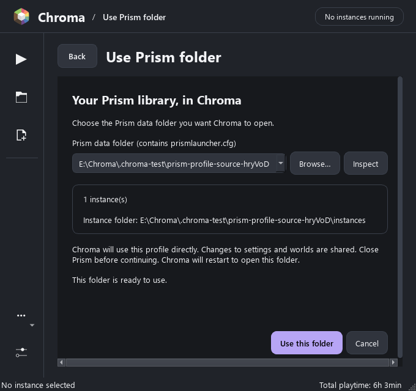

# Use your existing Prism folder

Chroma can open an existing Prism Launcher profile directly. It uses the same instances, mods, worlds, accounts, and launch settings. There is no import or extra copy of your modpacks.

## Choose the folder

1. Close Prism and any Minecraft games using that profile.
2. In Chroma, open **Launcher menu (•••) → Use Prism folder…**. An empty library also offers this action.
3. Select a detected folder or choose **Browse**. Choose the data folder containing `prismlauncher.cfg`, rather than an individual instance. The usual Windows location is `%APPDATA%\PrismLauncher`; portable installations keep it in their portable data folder.
4. Choose **Inspect** to see the instance count and resolved instance folder. Custom instance and icon locations remain in use.
5. Choose **Use this folder**. Chroma restarts once to open it.

Future normal launches of `chroma.exe` remember the selected folder. Selecting another folder uses the same workflow. The dialog disables a folder that Chroma is already using and shows any configuration errors inline.



## What is shared

Instances, worlds, account data, Java preferences, and other launch settings are shared with Prism. Edits made through either launcher affect those same files. Java installations and downloaded launcher files stay in their existing locations.

Chroma stores its interface preferences separately in `chroma-ui.cfg`, beside the selected profile's `prismlauncher.cfg`. This includes Chroma's theme, accent, icons, window layout, and other interface options. Prism keeps its own appearance settings.

The remembered folder is stored in `profile.json` in Chroma's home data directory. For an unpackaged Windows build, that is normally `%APPDATA%\Chroma`; the portable package uses its portable home directory. This small file points to the selected profile.

Keep Prism closed while Chroma uses its profile, and close Chroma before opening that profile in Prism. Chroma checks profile locks, but a different upstream Prism version may not fully honor Chroma's locks. Running both launchers against the same profile can cause conflicting writes.

Existing accounts are read from the shared profile. Successful sign-in or token refresh still depends on compatible, configured application credentials. The current default build retains Prism's public Microsoft application ID; see [Accounts and services](CHROMA.md#accounts-and-services). Changing that ID may require signing in again.

## Explicit profiles and development runs

Passing `--dir` chooses a profile for that launch and overrides the remembered folder:

```powershell
.\chroma.exe --dir E:\MyLauncherProfile
```

The repository's `scripts/run-chroma.ps1` runner follows the normal remembered-folder behavior by default. Passing `-DataDirectory` supplies an explicit `--dir` override, which is useful for an isolated development profile:

```powershell
.\scripts\run-chroma.ps1 -DataDirectory E:\MyLauncherTest
```

Profile inspection and selection have automated tests using synthetic profiles. The tests do not open your installed Prism profile.
