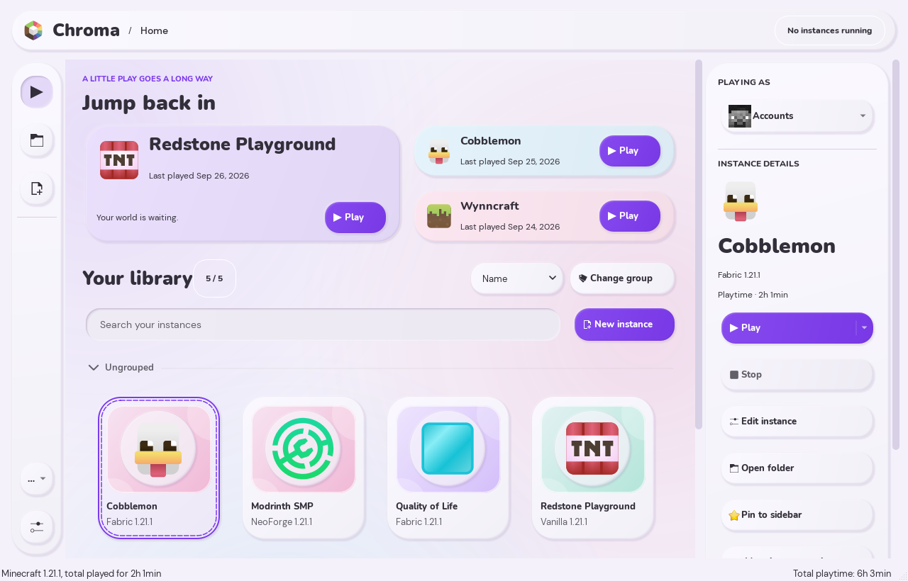
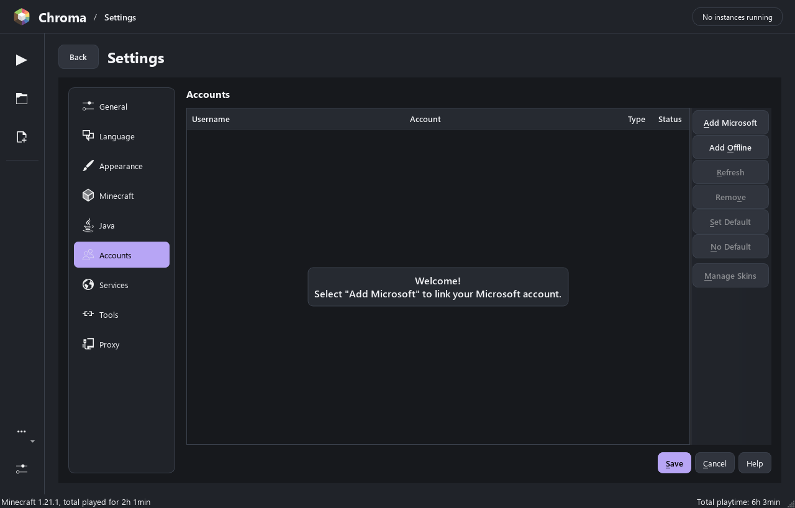

# Chroma guide

Chroma is an independent native UI fork of [Prism Launcher](https://github.com/PrismLauncher/PrismLauncher), based on release **10.0.5**, commit `16e541f4483241455ffb674bfe975e20158001a2`. It is not an official Prism release or endorsed by the Prism team. Upstream credits, licenses, and artwork attribution remain in the repository. The [project README](../README.md) has downloads and an overview.

## What is implemented

The default main window is rebuilt in C++ and Qt Widgets:

- A compact navigation rail and application header.
- Home and library views, with up to three recently played instances and one scrollbar from recent activity through every library card.
- Pinned instances in the persistent sidebar, with direct access to their instance pages.
- Search, sorting, native grouped instance cards, and selection details.
- Existing Prism actions for launch, stop, edit, accounts, folders, import, export, and instance management.
- A built-in clay color scheme with violet accents, six color presets, and a custom color picker.
- A native [Prism folder selector](CHROMA-MIGRATION.md) that opens your existing profile directly, sharing instances, worlds, accounts, and launch settings.
- Keyboard shortcuts, inline rename, native context menus, grouped drag and drop, and game status/progress indicators.
- An inline workspace for launcher settings, instance editing, account management, and adding instances, with the header and sidebar always available.
- A provider gallery for modpack discovery, followed by searchable cover grids and pack details with version selection.
- A Skin Library with account switching, plus Skin Studio for direct 3D painting, 2D texture editing, layer visibility, and local PNG saving.
- Pixel grids on both 3D skin layers, a clickable body-part diagram, and automatic selection of the visible outer layer for painting.
- GitHub release checks, including preview releases, with downloads and installation started by the user.

The structure lives in `LauncherHome`, `MainWindow`, `InlineWorkspace`, and `InstanceView`. It is compiled into the launcher. The Chroma palette supplies colors to those native widgets; no external theme installation or web wrapper is involved. The workspace reuses Prism's existing configuration and instance pages, including their validation and task handling.

The layout takes visual inspiration from Modrinth. Social and friends features are outside the current scope.



This is the actual Qt interface rendered by the native test harness with sample instances. Screenshots also show the [compact home layout](screenshots/compact.png), [inline settings](screenshots/inline-settings.png), and [instance creation](screenshots/inline-new-instance.png).

## Install and run

The [v0.3.0 preview release](https://github.com/nikitasokolov01/chroma/releases/tag/v0.3.0) provides a Windows x64 installer and a portable ZIP. Close Chroma before installing an update.

- **Installer:** install for your Windows account, then open Chroma. Its default profile is `%APPDATA%\Chroma`.
- **Portable ZIP:** extract it and run `chroma.exe`. Keep the folder together; its default profile lives beside the executable.

Both packages support opening an existing Prism folder. A remembered selection takes precedence over the default profile on future normal launches.

### Updating Chroma

**From 0.2.0 or earlier, download and install 0.3.0 manually once.** Those versions
do not contain Chroma's release updater. Keep your existing profile folder when
replacing a portable installation, then select it with **Chroma header menu →
Use Prism folder…** if needed.

From 0.3.0, automatic update checks contact Chroma's GitHub releases. In
**Settings → Launcher → Updater**, **Check for updates automatically** and
**Include prereleases** are enabled by default. Version 1.0.0 checks shortly after
launch and then hourly by default; an existing saved interval is preserved.
Set **How Often?** to **On Launch** to check only when Chroma starts. Automatic
checks show a notice with a feature summary; **What's new** opens the full notes
without closing the current page. **Later** hides that release for the session.
You can turn automatic checks off and still use **Check for updates now** or
**Chroma header menu → Check for updates…**.

An available update shows its version and release information. Choose **Download update**
to fetch it. Chroma validates the downloaded file against the release's SHA-256
checksum before offering installation. Choose **Install and restart** when ready;
a check alone never downloads or installs an update. The release page remains
available for manual downloads.

The [0.3.0 release notes](releases/0.3.0.md) record release validation and any
remaining limitations.

### Run a source build

From PowerShell in the repository:

```powershell
.\scripts\run-chroma.ps1
```

The runner follows the normal profile selection, including a remembered Prism folder. To choose an isolated development profile, pass an explicit directory:

```powershell
.\scripts\run-chroma.ps1 -DataDirectory E:\MyLauncherTest
```

Normal `chroma.exe` launches use the remembered Prism folder, if one has been selected. Without a selection, builds with `portable.txt` use the executable's folder; other builds use the **Chroma** application data location (on Windows, `%APPDATA%\Chroma`). The configuration filename remains `prismlauncher.cfg`. The runner's `-DataDirectory` option passes `--dir`, which overrides the remembered selection for that launch.

To open your existing library, choose **Chroma header menu → Use Prism folder…**, select the folder containing `prismlauncher.cfg`, inspect it, and choose **Use this folder**. Chroma restarts once and remembers the folder for future normal launches. Instances and worlds are used directly without copies. Keep Prism closed while Chroma uses that profile; upstream versions may not fully honor Chroma's profile locks. See [the folder guide](CHROMA-MIGRATION.md) for details.

Chroma's interface preferences are stored beside the active configuration in `chroma-ui.cfg`; its remembered profile pointer lives in `profile.json` in Chroma's home directory. The Chroma palette is selected by default. Change it under **Settings → Launcher → Appearance**. All profiles use the rebuilt main window.

## Accounts and services

Open **Settings → Accounts → Add Microsoft** to connect your account using the existing Prism authentication flow. The current default build uses Prism's public Microsoft application ID, so Microsoft's sign-in or consent screen may name **Prism Launcher**. This public identifier is not an account password or a client secret. Minecraft ownership and account checks remain unchanged.



If a custom build has no Microsoft client ID, **Add Microsoft** stays visible but disabled. The notice's **Configure Microsoft sign-in** button opens **Services → API Keys → Microsoft Authentication**. Enter the application's client ID, save settings, and return to Accounts. [Prism documents the API settings](https://prismlauncher.org/wiki/help-pages/apis/).

CurseForge requires an API key in **Settings → Services** or at build time. Imgur credentials are also unset by default. Modrinth browsing uses Prism's existing integration. Opening a shared Prism profile shares its accounts; changing the Microsoft application ID can require signing in again.

Read the [privacy guide](../PRIVACY.md) for local account storage, network connections, and controls over your data.

## Skin Library and Skin Studio

For the tools in the local v1.0.0 release, see the
[Skin Studio tools guide](SKIN-STUDIO-TOOLS.md), including outfits, mirror painting,
palette swaps, texture brushes, selections, reference skins, and Skin Extras.
The published 0.3.0 controls are described below.

Open **Skins** in the sidebar. The account dropdown chooses whose skins and capes
to manage without changing the default launch account. Select or import a skin,
then choose **Edit Skin…** or double-click it. Local editing also works without
an account.

Skin Studio opens in **3D Paint** when OpenGL is available. Left-drag on the model
to paint; right-drag to rotate and scroll to zoom. **Reset view** restores the
camera. Switch to **2D Texture** to paint on the PNG beside a live 3D preview.
The texture, selected color, brush size, model, and undo history stay shared
between both modes. Without OpenGL, the 2D editor has a front/back image preview.

- **Colors:** drag the visible wheel to choose hue, saturation, and brightness.
  Enter `#RRGGBB` for an exact color or `#AARRGGBB` to include opacity. The opacity
  slider and palette swatches use the same brush color.
- **Layers:** the **Body** and **Outer layer** buttons toggle visibility globally.
  When Outer layer is visible, painting changes only the outer layer, including
  transparent pixels. Hide it to paint the body. Hiding both layers disables
  painting. These rules also apply to the 2D texture. Body pixels stay opaque;
  outer pixels support transparency and erasing.
- **Body parts:** click the head, torso, arms, or legs in the body diagram to hide
  that part on both layers. Click again to show it. Tab focuses each part and
  Space toggles it. Hiding parts lets you reach surfaces behind them without
  changing the PNG; hidden parts cannot be painted in either view.
- **Pixel grid:** **Grid** shows the individual pixels on each visible body and
  outer surface in 3D. Both grids remain visible when both layers are enabled.
  The same control toggles the grid on the 2D texture when zoomed in.
- **Tools:** with a canvas focused, press **B** for brush, **E** for eraser,
  **I** for color picker, or **H** to rotate the model or pan the texture.
  Alt-click samples a color. In 2D, arrow keys move the pixel cursor, **Space**
  paints, and plus/minus zoom. Middle-drag pans the texture.
- **Saving:** use undo/redo, import/export PNG, or **Save to Library**. Classic and
  Slim models use their own texture regions; older 64 × 32 skins normalize to
  64 × 64. **Apply Skin** saves locally and uploads to an eligible Microsoft
  account with a Minecraft Java profile. Offline accounts can edit and export.

The color wheel stays beside the canvas in compact windows; palette, layer, and
model controls scroll beneath it when needed. Editing locally does not upload the skin.

## Home, pins, and navigation

Scroll Home from **Jump back in** through the library using the page scrollbar or the mouse wheel over a card. The search, filters, and cards move with the page. **Library** in the sidebar opens the library without the recent section. Group collapse, sorting, search, keyboard selection, and drag and drop continue to use the native instance view.

Select an instance and choose **Pin to sidebar** in its details panel, or right-click its card and choose **Pin to sidebar**. Its icon appears below the main sidebar navigation. Click a pinned icon to open that instance's editor. Pins keep their order across restarts and follow instance name and icon changes. Deleting an instance removes its pin.

To remove a pin, choose **Unpin from sidebar** in the selected instance's details or context menu, or right-click its sidebar icon and choose **Unpin from sidebar**. The pin area scrolls when there are more icons than fit. Pins are saved as `ChromaPinnedInstances` in the active profile's `chroma-ui.cfg`.

Launcher screens open inside the workspace. **Back** closes the current screen and returns to the previous one; **Home** and **Library** return to the library after the active pages accept closing. Existing save checks, confirmation prompts, and task cancellation controls still apply. File, color, and icon pickers also appear inline. During a running task, its cancellation control remains available and navigation waits for the task to finish. On narrower windows, settings pages use a page selector in place of a wide page list.

Click **Chroma** in the header to open the launcher menu. It contains profile
selection, update checks, accounts, and instance commands previously reached
through the sidebar overflow button.

## Browse modpacks

Choose **New instance** to open the provider gallery. Pick **Modrinth**, **CurseForge**, **ATLauncher**, **Technic**, or **FTB Legacy**, then browse that service's pack covers. Services unavailable in the current build are labeled in the gallery. The service selector lets you switch catalogs, and **All providers** returns to the gallery.

Search and filter within a catalog, select a pack, and choose a version in its details. **Install modpack** uses the selected provider's existing installation workflow. Expand **Instance options** to change the name, group, or icon. The gallery also has separate actions to create a custom Minecraft instance, import a file or link, and import from the FTB App.

Provider requests, downloads, metadata, and install tasks use Prism's native integrations.

See the [provider gallery](screenshots/provider-gallery.png), [pack catalog](screenshots/modpack-catalog.png), and [pack details](screenshots/modpack-details.png). The catalog screenshots use synthetic sample packs loaded through the real provider model for UI verification.

## Build from source

The Windows scripts use Visual Studio 2022 C++, Qt 6, CMake 3.28+, Ninja, vcpkg, and JDK 17. Toolchains and build output are excluded from Git; a clone does not include the local `.tools` directory.

```powershell
git clone --recurse-submodules https://github.com/nikitasokolov01/chroma.git
cd chroma
```

Install the [Prism build prerequisites](https://prismlauncher.org/wiki/development/build-instructions/), including Qt SVG, NetworkAuth, and Image Formats. Put CMake and Ninja on PATH. Supply your dependency locations when configuring:

```powershell
.\scripts\build-chroma.ps1 -Action All `
  -QtRoot C:\Qt\6.5.3\msvc2019_64 `
  -VcpkgRoot C:\dev\vcpkg `
  -JavaHome 'C:\Program Files\Java\jdk-17' `
  -VcVars 'C:\Program Files\Microsoft Visual Studio\2022\Community\VC\Auxiliary\Build\vcvars64.bat'
```

Adjust those example paths for your installation. The verified Windows toolchain uses Qt 6.5.3 with MSVC. Without path arguments, the script expects Qt and vcpkg under `.tools` and uses its documented defaults for Visual Studio and Java. The build output is `.tools/build/chroma.exe`; `-Action Configure`, `Build`, and `Test` run individual steps.

### Application IDs and API keys

The default build retains Prism's public Microsoft OAuth application ID. `CHROMA_MSA_CLIENT_ID` or the build script's `-MicrosoftClientId` parameter overrides it. Passing `-MicrosoftClientId ''` explicitly disables the build-time ID; a saved Services override can still supply one. Review the [upstream custom-build guidance](UPSTREAM_README.md#forkingredistributingcustom-builds-policy) when distributing a modified launcher with external service integrations.

CurseForge and Imgur credentials are empty by default. Chroma's updater checks its own GitHub releases. Supply a CurseForge key through `CHROMA_CURSEFORGE_API_KEY`, the build script's `-CurseForgeApiKey` parameter, or Services settings. Keep private keys out of the source tree and commit history.

### Native UI verification

The optional Qt test harness exercises the real main window using synthetic instances in an isolated profile. It checks filtering, selection, action states, sorting, whole-page scrolling, sidebar pins, custom accent persistence, and direct profile use. Inline settings, instance editing, nested pickers, confirmations, and task cancellation are checked for correct navigation and dialog lifetimes. Catalog checks cover the provider gallery, populated card grids, keyboard selection, pack versions, instance options, search resets, and provider switching. Skin checks cover account selection, editing modes, shared history, the inline color wheel, opacity, the body diagram, and layer visibility using original synthetic textures. Updater checks use mock GitHub responses and preserve an unsaved skin while an inline update offer opens and closes. Layout checks cover 1280×820, 800×820, and 680×640 and save screenshots. The harness does not open your installed Prism profile, sign in, or launch Minecraft. See the [release notes](releases/0.3.0.md#verification) for the completed checks and final counts.

```powershell
. .\scripts\build-chroma.ps1 -Action Environment # Add your dependency path arguments here.
cmake --build .tools/build --target ChromaUiSmoke --parallel 6
$env:QT_QPA_PLATFORM_PLUGIN_PATH = "$QtRoot/plugins/platforms"
$env:QT_QPA_PLATFORM = 'offscreen'
$env:CHROMA_UI_TEST_ROOT = "$PWD/.chroma-test/ui"
& .\.tools\build\ChromaUiSmoke.exe
Remove-Item Env:QT_QPA_PLATFORM
Remove-Item Env:QT_QPA_PLATFORM_PLUGIN_PATH
Remove-Item Env:CHROMA_UI_TEST_ROOT
```

The test executable is `.tools/build/ChromaUiSmoke.exe`; screenshots are written under `.chroma-test/ui`. The last commands restore interactive rendering for this shell.

## Portable Windows package

Release maintainers should also read the [release licensing notes](RELEASE-LICENSING.md) and [third-party notices](../THIRD_PARTY_NOTICES.md).

After a successful build, package the executable, Qt plugins, native libraries, and Java helpers:

```powershell
.\scripts\package-chroma.ps1
```

The script prints the new package path under `dist`; run `chroma.exe` there and keep its folder together. It requires an empty output directory so existing profile data cannot enter the release package. The portable profile is stored beside the executable until another profile is selected. Use **Chroma header menu → Use Prism folder…** to select an existing Prism profile. The script accepts `-OutputDirectory`, `-RuntimeDirectory`, and the same dependency path options as the build script. Redistributable runtime DLLs must be available in `.tools/release-runtime` or the supplied runtime directory. It does not install or launch the application.

On Windows, the test runner stages the two upstream directory-symlink fixtures inside `.tools/build` so the tests also work when Git checked out symlinks as text files.

## Release versions and Windows installer

Chroma has its own version sequence, with **1.0.0** prepared as the first version
after the 0.x previews. The three `Launcher_VERSION_*` numbers in `CMakeLists.txt`
are the source of truth for the app, installer, package README, and source
archives. Add notes under `docs/releases/`; update public download links only
after publishing the matching release.

For a local release candidate, configure with `-ReleaseBuild` to display the core
version while preserving the actual Git commit and branch in build information.
The underlying CMake option is `Launcher_RELEASE_BUILD`. A later configure without
the switch restores development version display; the switch does not commit,
tag, publish, or change update settings. Tagged builds also recognize matching
`1.0.0` or `v1.0.0` tags as stable.

Freeze source changes before the final build so the matching source archive can
capture the same inputs. Run the unit and native UI checks before packaging.
With the release tools and runtime DLLs prepared, a local candidate uses:

```powershell
.\scripts\build-chroma.ps1 -Action All -ReleaseBuild
.\scripts\build-installer.ps1
.\scripts\test-installer.ps1
$version = .\scripts\get-chroma-version.ps1
.\.tools\python\Scripts\python.exe scripts/archive-chroma-source.py --working-tree --output "dist/release/v$version/Chroma-$version-source.tar.gz"
.\.tools\python\Scripts\python.exe scripts/archive-dependency-sources.py
Copy-Item -LiteralPath '.tools/release-licenses/qt-everywhere-src-6.5.3.tar.xz' -Destination "dist/release/v$version/"
.\scripts\write-release-checksums.ps1 -ReleaseDirectory "dist/release/v$version"
```

The installer and portable ZIP are written to `dist/release/v<version>/`.
Packaging rejects a stale executable version or existing release output. It
generates `SHA256SUMS.txt` for the binary packages and manifest; run the checksum
helper again after adding all source assets. The matching Qt source archive must
be available locally before copying it into the release directory.
Installer checks use a temporary directory without shell integration and verify
install, upgrade, uninstall, bundled runtime loading, and profile preservation.
For an upgrade from an existing release, additionally run
`scripts/test-update-packages.ps1` with `-ReleaseDirectory`, `-PreviousInstaller`,
and `-PreviousZip` pointing to the new directory and previous release packages.

The working-tree source mode includes tracked local changes and nonignored new
source files, records the base commit and per-file content hashes, and excludes
local tools, test output, environment files, and launcher profiles. It includes
initialized submodules at their actual checked-out revisions and rejects dirty
submodules. It uses fixed archive timestamps from the base commit so identical
source inputs produce identical archives. When packaging a committed release,
use `--ref "v$version"` instead of `--working-tree`. Both modes preserve submodule
sources, and neither changes the repository.

Publish both packages, the application and dependency source archives, the
matching full Qt source archive, `package-manifest.json`, and `SHA256SUMS.txt` on
the same GitHub release. See [release licensing](RELEASE-LICENSING.md) for the
source inventory. Publication is a separate step; these local scripts do not
create a release or upload anything. Keep previous releases available.

## Implementation notes

- `MainWindow` owns selection and existing QActions. `LauncherHome` shares those actions, stores pins by instance ID, and resolves recent-instance IDs before launching.
- `InlineWorkspace` hosts existing Qt screens and nested prompts. Navigation uses their normal close handling before returning to Home.
- `ModpackBrowser` supplies the provider catalog and details layout; `ModpackCardDelegate` renders covers, titles, authors, and summaries. Provider pages retain their native models and install tasks.
- `InstanceView` remains the source of keyboard navigation, grouped layout, accessibility, selection, and drag/drop. On Home it expands to the full grouped content height and forwards wheel scrolling, selection visibility, and drag-edge scrolling to the outer page. The delegate draws the larger cards.
- `ChromaTheme` supplies the light and dark clay palettes and bundled fonts. `ClayStyle` and `ClayWidgets` share surface painting, motion preferences, and native controls; the original Dark palette remains available for existing custom themes.
- `AccentColor` validates saved values and chooses readable foreground colors.
- `ChromaProfile` inspects existing Prism folders and stores the remembered selection. `ChromaSettingsObject` keeps interface preferences in `chroma-ui.cfg` while launch preferences remain in `prismlauncher.cfg`.
- Below 1,000 logical pixels, the details panel hides to preserve library space. The Chroma header menu retains accounts and instance actions.

## Further development

Home, the library, pins, and the inline workspace are implemented. Individual instance and settings pages retain Prism's established controls inside the updated layout. Current release packages target Windows x64. Cross-platform packaging and further page-specific redesign are future work. The native harness verifies UI behavior with isolated fixtures; it does not verify a complete live account sign-in or Minecraft launch.
