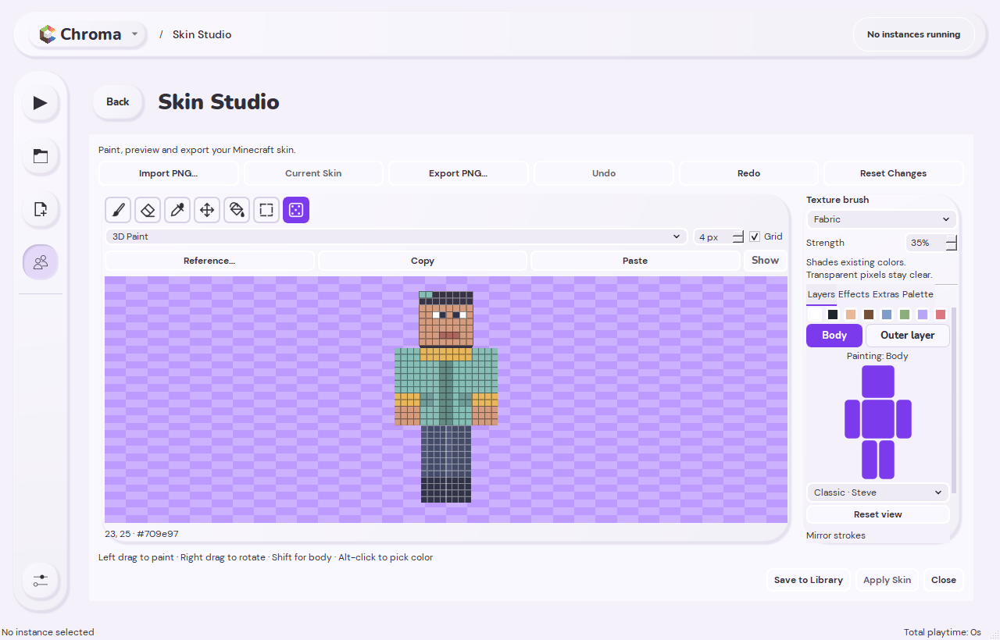
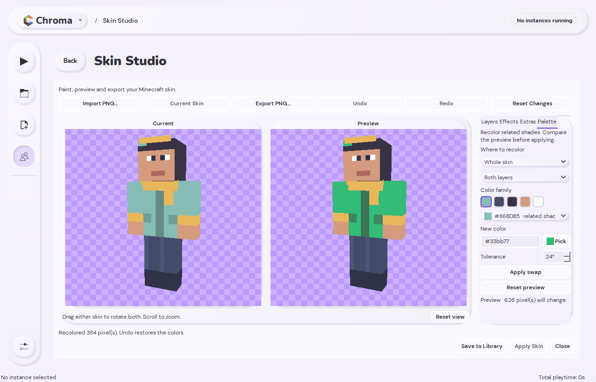
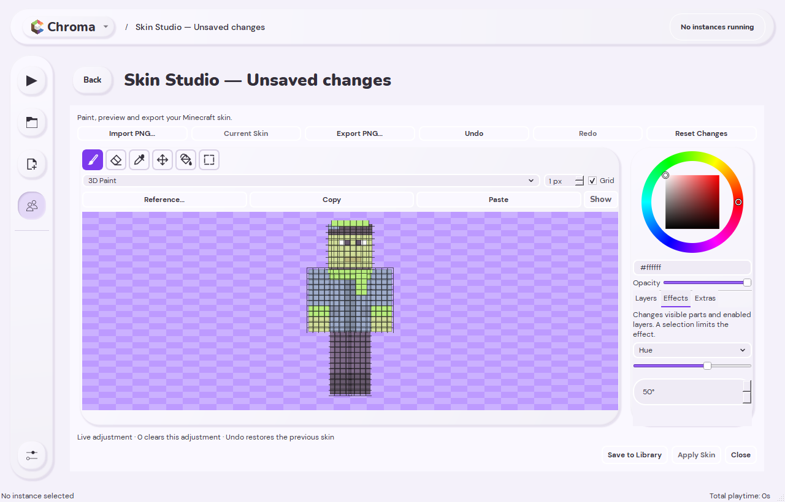
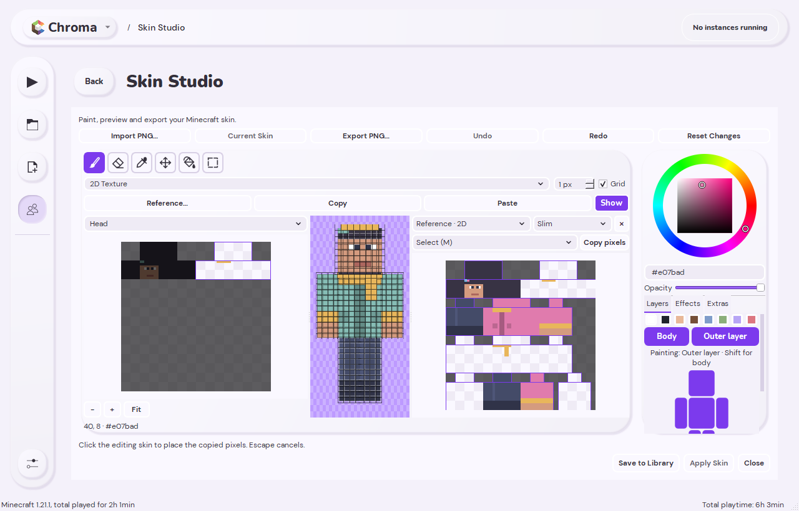
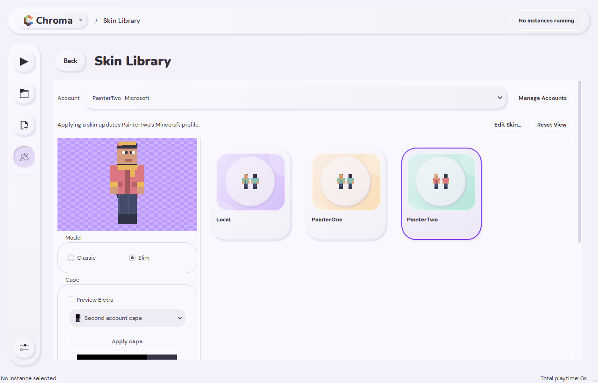
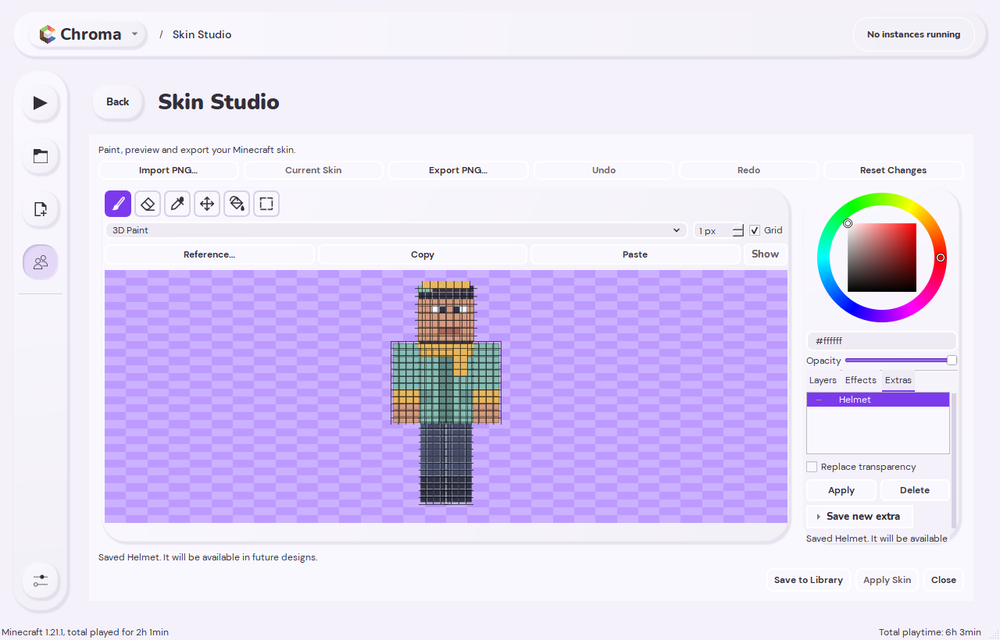
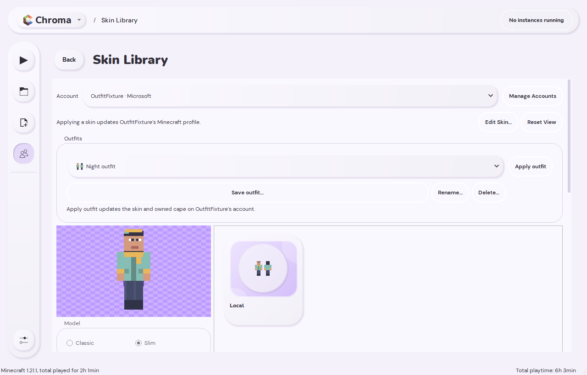

# Skin Studio tools for v1.0.0

These tools are included in Chroma's first stable release, **v1.0.0**.
See the [release notes](releases/1.0.0.md) and
[Windows downloads](https://github.com/nikitasokolov01/chroma/releases/tag/v1.0.0).

## Paint, fill, and select

- **Brush (B)** paints individual pixels; **Eraser (E)** clears outer pixels.
- **Texture brush (T)** adds shading using the colors already painted on the skin.
- **Bucket (G)** fills connected pixels of the same color. In 3D it stays on the
  clicked face; in 2D it follows the active texture regions. A selection limits
  the fill.
- **Marquee (M)** selects a rectangle. On the 3D model, the selection includes
  visible surface pixels inside that rectangle. On the texture, it selects
  pixels directly. Selected pixels stay highlighted when you change tools.
- **Color picker (I)** samples a pixel. Alt-click also picks a color.
- **Pan / Rotate (H)** moves the texture or rotates the model. Right-drag rotates
  the 3D model regardless of the selected tool.

While **Outer layer** is visible, tools target it. Hold **Shift** to temporarily
fade the outer layer and work on the body beneath it. Release Shift to return to
the outer layer. Hidden body parts and a hidden body layer remain protected.
The preview fade does not change the PNG's opacity.

An active marquee limits brush strokes, fills, pastes, and effects. Clear the
selection before editing the whole visible region again. Copy with **Ctrl+C**;
**Ctrl+V** prepares the copied pixels for placement. Click the model or texture
to place them, or press **Escape** to cancel placement.

## Mirror painting

In **Layers**, enable **Head and torso**, **Pair arms**, or **Pair legs** under
**Mirror strokes**. Each option can be switched on independently. Brush,
eraser, and texture strokes reflect across the character in both 2D and 3D, including
side, top, and bottom faces and Classic/Slim arms. Both sides share one undo step.

Mirroring respects the active layer, hidden parts, the selected editing region,
and marquee selection. To paint both arms, leave both visible and use **All body
regions**. Bucket fill, pasted pieces, and color effects keep their normal scope.

## Texture brush

Select the dotted **Texture brush** icon or press **T**. Its settings replace the
color wheel in the inspector, leaving room for the canvas. Choose **Fine grain**
for scattered shading, **Fabric** for a subtle weave, or **Hair** for vertical
strands, then adjust **Strength** and the brush size.

Paint directly on the 3D model or the 2D texture. Each pixel keeps its existing
hue, saturation, and opacity; transparent pixels stay clear. Repeated mouse
events within a stroke do not build up noise. Each new stroke can deepen the
texture, and **Undo** restores the entire stroke, including its mirrored side.
Hidden parts, active layers, and marquee selections limit the brush.

## Palette swapping

The **Palette** tab opens large **Current** and **Preview** 3D models. Drag either
to rotate both, scroll to zoom, or select **Reset view** to fit them again.
Systems without 3D support use large front/back previews.

Use **Where to recolor** to choose the whole skin, head, torso, paired arms or
legs, or an individual limb. Choose the body layer, outer layer, or both.
The color-family swatches update to match that scope, visible parts, and any
marquee selection. Select a swatch, enter a hex color or select **Pick**, and
adjust the hue range to include more or fewer related shades. Gray shades are
kept separate from colored families. **Pick** opens a floating color wheel beside
the control; changes preview immediately. Click outside or press **Escape** to
close it without leaving Skin Studio.

Previewing does not change your skin; **Apply swap** commits one undoable change. **Reset preview**
returns the target color to the selected source. Shadows, highlights, and pixel
opacity are retained, and hidden parts, hidden layers, and pixels outside a
selection are protected. For example, select **Torso** and **Body layer** to
recolor a shirt without changing matching colors on the arms or head. Leaving
Palette restores the editing view and tool settings.

## Effects

Open the **Effects** tab under the color controls. **Hue** and **Brightness**
update the skin as you move the slider or change the number. Every adjustment
uses the same starting colors: changing hue from 40° to 50° applies 50° from
the starting skin. It does not add another 50° to the previous preview.

Hue and brightness remember their separate values when you switch effects.
Set an adjustment to **0** to remove it. Both sliders share one undo step,
and **Redo** restores their values. Painting, pasting, changing the selection,
or changing visible parts or layers finishes the adjustment; further slider
changes start from the resulting skin.

**Grayscale** and **Invert** use **Apply effect**. Each application is one undo
step.

Effects apply to the enabled layers of the body parts shown in the preview.
Hide a part or layer to protect it. If you also have a marquee, only selected
pixels within that visible region change. Alpha is preserved, and fully
transparent pixels are left alone.

## Reference skins

Import a second PNG as a reference without replacing the editing skin. The
reference has its own Classic/Slim setting and can be viewed in 3D or as a 2D
texture. The toolbar selects the tool for both views. Use **Color picker** and
**Marquee** on either skin to sample colors or copy pixels. Painting and effects
belong to the editing skin; the reference remains read-only.

The reference has its own body-part diagram and **Body / Outer layer** buttons.
These hide reference parts or layers without changing the editing skin's
visibility controls.

Select an area on the reference, copy it, then paste into the editing view.
Pasting is undoable. Hide the reference panel whenever you want more canvas
space; the imported reference stays available during the editing session. In
small windows, use **Editing / Reference** to switch between canvases. Choosing
Paste returns you to the editing skin.

## Owned capes

Open **Skins**, choose a Microsoft account, and select one of its owned capes
from the cape dropdown. The preview shows the selected cape. Choose
**Apply cape** to equip it without uploading or changing your skin. Select
**No Cape** and apply it to remove the equipped cape.

Cape changes require an eligible Minecraft Java account and are unavailable
while it is signing in or running Minecraft. Local skin editing remains
available without an account.

## Skin Extras

The **Extras** tab holds reusable pieces across editing sessions.

1. Open **Save new extra** and choose **Editing skin** or **Reference skin** as the source.
2. Choose the part and layer to save. For a helmet, choose **Head** and
   **Outer layer**. For a full jelly coating, choose **Whole skin** and
   **Outer layer**. A marquee further limits what is saved.
3. Enter a name and select **Save extra**.
4. In a later design, select that extra in the inventory and choose **Apply**.

Extras return to their original body parts. Classic and Slim arm faces are
mapped when the saved and current models differ. Your current marquee limits
where an extra can be applied; clear it to apply the entire saved piece.

Transparent pixels preserve existing details by default, so you can combine
pieces. Enable **Replace transparency** to clear the corresponding outer pixels
as well. Applying an extra is one undo step. Deleting an inventory entry asks
for confirmation and does not change the skin being edited.

Extras are stored in `skin-extras` inside the active launcher profile. They stay
local and are preserved by launcher updates. Back up this folder with the rest
of your profile.

## Outfit presets

Use **Save outfit** in **Skin Library** to save a named snapshot of the selected
skin and its Classic/Slim model. Any Extras already applied to that skin become
part of the snapshot. Save your edited skin to the library first, then save the
outfit. Include the cape choice when you want the outfit to equip an owned cape
or remove it; leaving the cape choice out keeps the account's cape unchanged.

Selecting an outfit previews it locally. Presets remain available across
sessions and can be renamed or deleted without changing the original skin.
**Apply outfit** uploads its skin and applies its saved cape choice to the
selected account. An account that does not own the saved cape cannot apply that
outfit. Sign-in must be complete and Minecraft closed before applying it.

Outfits are stored in `skin-outfits` inside the active launcher profile and are
preserved by launcher updates. They contain local skin/cape snapshots, not
account credentials. Editing or deleting an Extra later does not change saved
outfits.

## Verification

Verification covers 36 test suites, 55 native interface checks, and 54 fallback
interface checks (the native OpenGL mirror test is intentionally skipped there).
After correcting test assumptions for Slim UVs and headless fonts, the palette
suite passes all 14 checks on both platforms. Screenshot review caught compact
tab overflow and file-control sizing; the affected Skin Studio checks were
rerun on both renderers after fixing them. No failed checks remain. The earlier
nine updater preservation checks also passed.

Coverage includes selected-pixel copy/paste, visible-part effects, Shift cleanup,
live adjustment history, independent reference visibility, Classic/Slim
conversion, undo, and saving then applying Extras in another session. New checks
exercise mirrored anatomical faces, actual 2D/3D strokes, hidden destinations,
texture patterns and repeat-event stability, synchronized palette cameras,
scoped palettes, popup typing/dismissal, preview/undo and shade preservation,
outfit persistence, source-skin
protection, and missing-preset recovery. Cape requests use a simulated account
and network; outfit UI checks verify local save/preview and account eligibility
without uploading to a real account.
The screenshots above use synthetic skins and an isolated test profile.
